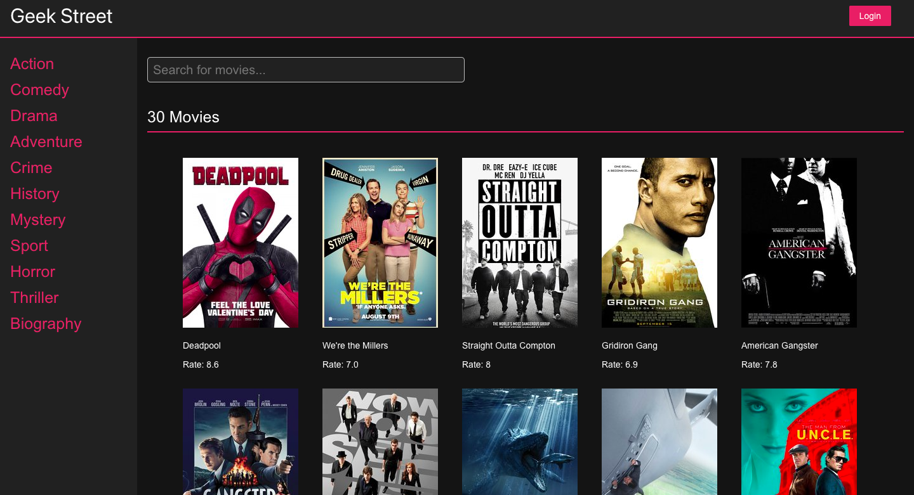

# Web Project - Movie Reviews


## About Project
Team project for Web Development subject at KBTU (spring 2021).
Project - Web Site for Movie Reviews. We have:
* Homepage
* Movie Detail page
* Login page
* JWT tokens
* Comments
* Django implementations
* Mysql implementations
## Movie Detail Page Example  


## Frontend:

Angular, TypeScript, HTML, CSS  

## Backend: 
Python, Framework Django 2
## Getting Started
### Angular Side
1. Clone this `repo`
``` Shell
$ git clone https://github.com/diable201/WEB-Project.git
```
2. Inside `Frontend` folder run the command for installing dependencies 
``` Shell
$ nmp install
```
### Django Side
3. Install `virtualvenv` if you don't have it
``` Shell
$ pip install virtualenv
```
4. Create virtualenv
``` Shell
$ virtualenv venv
```
5. Activate virtualenv
``` Shell
$ source venv/bin/activate
```
6. Then can install all the required dependencies:
``` Shell
$ cd Backend
$ pip install -r requirements.txt
```
## Run The App
To start the backend django server run
``` Shell
python manage.py runserver
```  
From the `Backend` folder. Server will be running on `http://localhost:8000/`

To start the frontend angular app run
``` Shell
ng serve -o
```
From the `Frontend` folder. Client will be running on `http://localhost:4200/`
## Team members
| Surname       | Name          | Github                                        |
| :-----------: |:-------------:| :-------------:                               |
| Seitbekov     | Sanzhar       | [Click Here](https://github.com/diable201)    |
| Sagynbayev    | Almaz         |   [Click Here](https://github.com/sagynbayev) |
| Sarsengaliyev | Zhaisan       |    [Click Here](https://github.com/Zhaisan)   |
## License
This repository is released under the [MIT license](LICENSE.md). In short, this means you are free to use this software in any personal, open-source or commercial projects. Attribution is optional but appreciated.